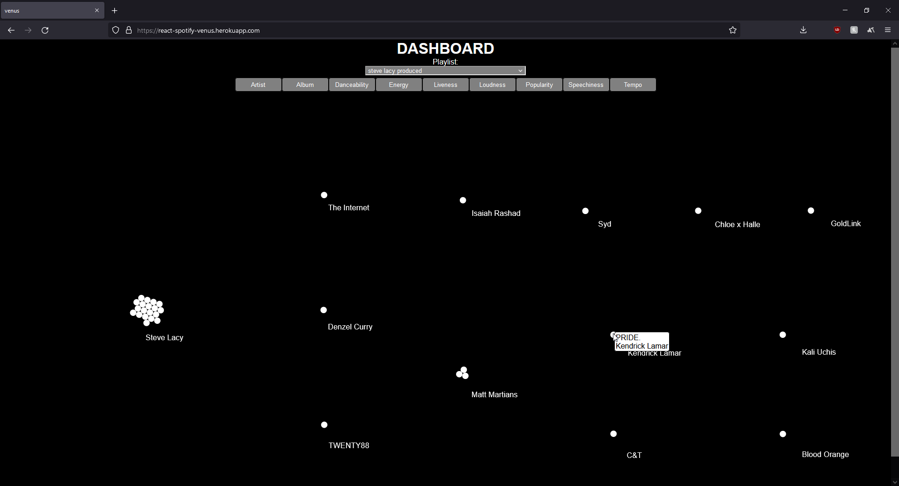

## venus

`venus` is a fun web application project utilizing React and D3.js to visualize your playlist songs pulled from the Spotify API. This project is an extension of `bird-scout` in incorporating an external API server-side; however, with a more [thorough authorization code flow](https://developer.spotify.com/documentation/general/guides/authorization/code-flow/).

[Live Demo](https://react-spotify-venus.herokuapp.com/)


.png>)

### Summary

I spend a majority of my day either listening to or searching for more music that pique my interest. Spotify is an application I cannot go a day without listening to music whether it's in the car, showering, or even cleaning around the house. Spotify provides interesting [quantitative audio features](https://developer.spotify.com/documentation/web-api/reference/#/operations/get-audio-features) such as the danceability, energy, or tempo of a song.

`venus` was an inspiration from my school alumni's [blog post](https://www.kexinzhang.com/2018/12/20/2018-in-music.html) reviewing her music taste in the 2020 year. I thought it was an awesome way to compare your music within a playlist and was greatly intrigued by the Mike Bostock's use of D3.js for the [Beeswarm diagram](https://bl.ocks.org/mbostock/6526445e2b44303eebf21da3b6627320) and [Circle Packing diagram](https://bl.ocks.org/mbostock/ca5b03a33affa4160321). This provided invaluable experience working with React, Spotify's API, and d3-force. Some struggles I encountered were interesting behaviors using d3-force in a React application such as the re-rendering of a component causing the node positions and simulation to not retain its previous value due to re-rendering.

### How to run locally
Create a .env file in server folder
```bash
cd server
touch .env
```

Set your Client ID, Client Secret from the Spotify Developer dashboard and set the redirect URI in your application dashboard settings
```
SPOTIFY_CLIENT_ID=YOUR_SPOTIFY_CLIENT_ID
SPOTIFY_CLIENT_SECRET=YOUR_SPOTIFY_CLIENT_SECRET
REDIRECT_URI=http://localhost:8888/callback
```

Run development server
```bash
cd server
npm run dev-start
```
